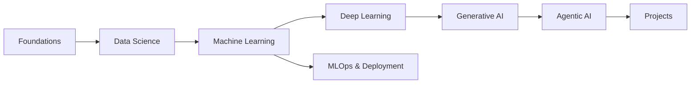

# AI/ML Compendium

> A curated, sequential learning resource for Data Science, Machine Learning, Deep Learning, Generative AI, and Agentic AI.

    

## What This Is / Isn't

**This is:** A structured, opinionated collection of the best learning resources — docs, videos, courses, papers, playgrounds, and notebooks — organized to be followed sequentially, not just browsed.

**This isn't:** A collection of hosted courses or original tutorials. We curate and link to existing high-quality content, keeping the repo lightweight and focused on navigation.

## Visual Roadmap



## Table of Contents

<!-- START doctoc generated TOC please keep comment here to allow auto update -->
<!-- DON'T EDIT THIS SECTION, INSTEAD RE-RUN doctoc TO UPDATE -->
<!-- END doctoc generated TOC please keep comment here to allow auto update -->

## How to Use This Repo

- **Following a track:** Start with the [learning paths](./learning-paths/) for curated sequences tailored to different roles.
- **Jumping to a topic:** Use the folder structure — each numbered folder is a module, and each file covers a subtopic.
- **Quick reference:** The [Visualizers & Playgrounds](./visualizers-and-playgrounds/) and [Research Papers](./09-research-papers/) sections are cross-domain indexes.

## Quick Links

- [Visualizers & Playgrounds](./visualizers-and-playgrounds/)
- [Latest Papers: GenAI & Agentic](./09-research-papers/genai-and-agentic-papers.md)
- [Interview Prep](./10-interview-prep/)
- [Community Resources](./community/)

## Contributing

We welcome contributions! The two main ways to help:

- **Add a resource:** Use the [Quick Add](https://github.com/dsai-iitbhilai/the-ai-ml-compendium/issues/new?template=quick-add-resource.yml) template — no Git required
- **Remove or replace a resource:** Use the [Update Resource](https://github.com/dsai-iitbhilai/the-ai-ml-compendium/issues/new?template=remove-replace-resource.yml) template

For larger changes (new topics, structural edits), see [CONTRIBUTING.md](./CONTRIBUTING.md).

## Development Setup

```bash
git clone https://github.com/dsai-iitbhilai/the-ai-ml-compendium.git
cd the-ai-ml-compendium
pip install -r requirements.txt
mkdocs serve
```

Then open `http://127.0.0.1:8000` in your browser. Changes to `.md` files hot-reload automatically.

## License

- **Code and notebooks** in `08-projects-and-examples/` are licensed under [MIT](./LICENSE).
- **All other content** (curated lists, READMEs, documentation) is licensed under [CC BY 4.0](https://creativecommons.org/licenses/by/4.0/).
